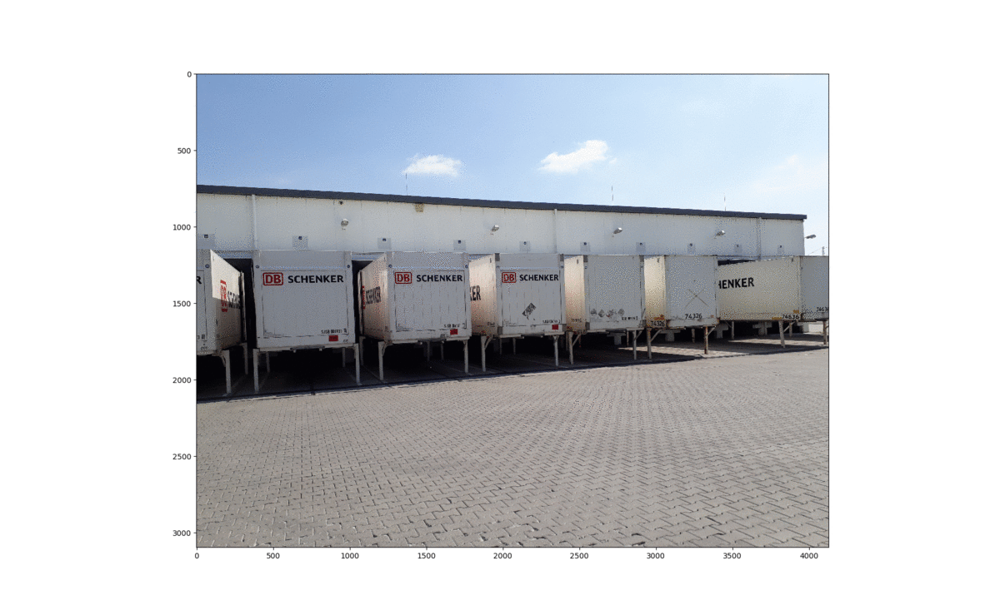
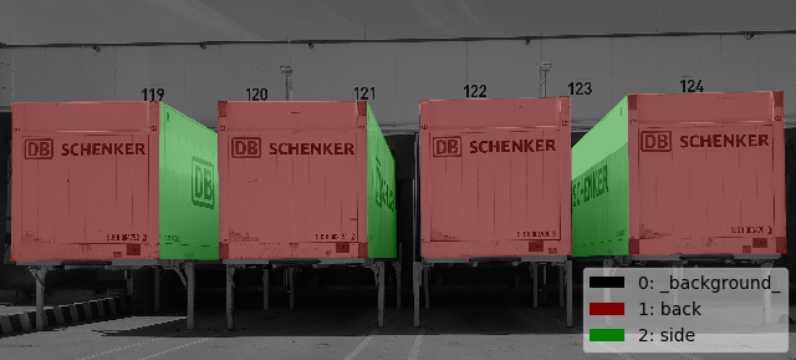
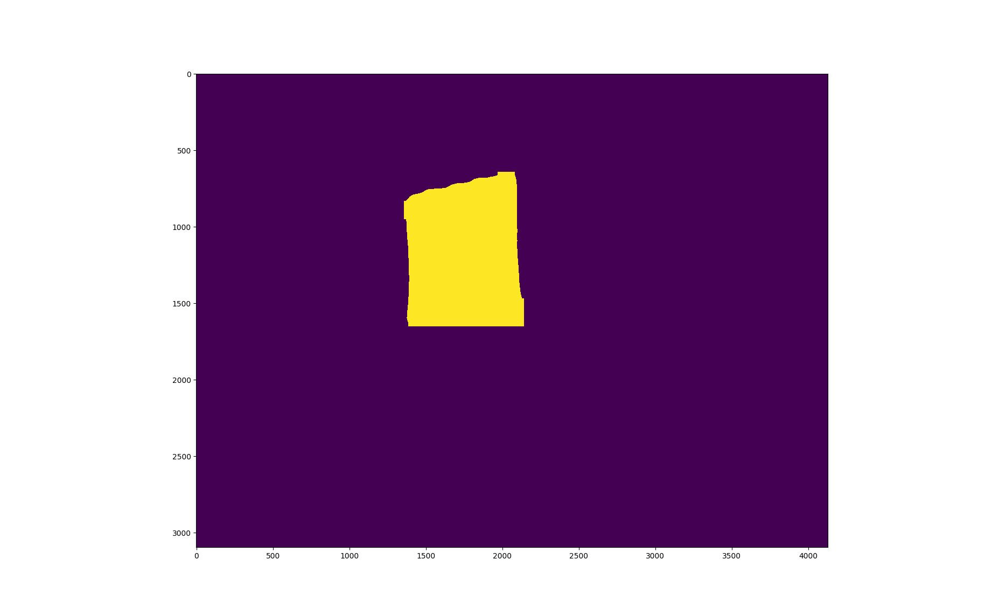
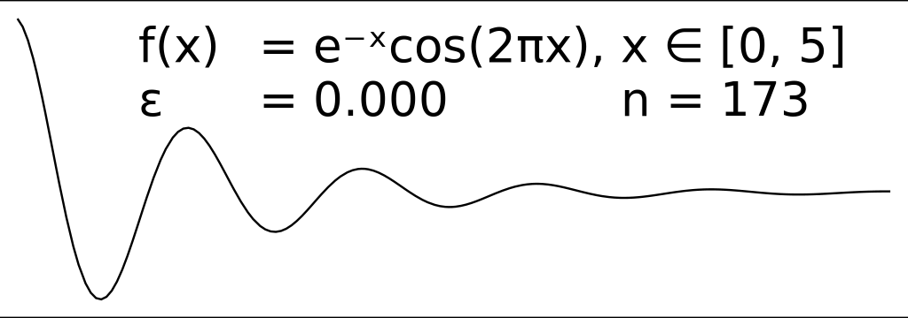
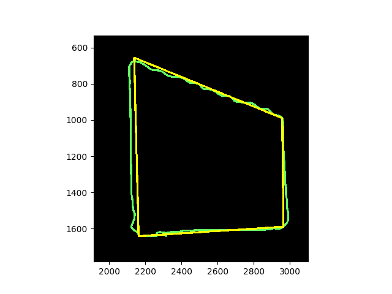
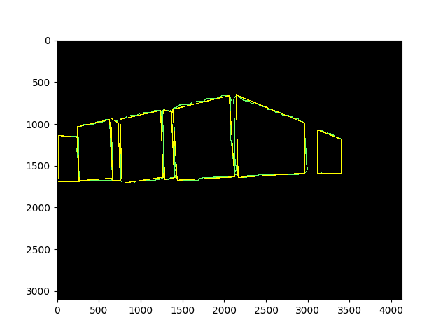
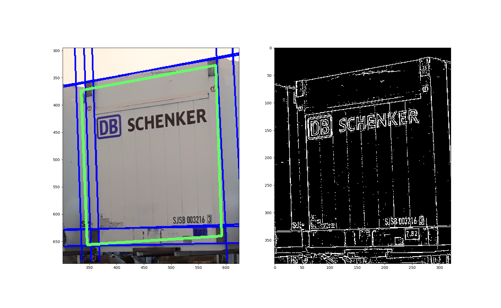
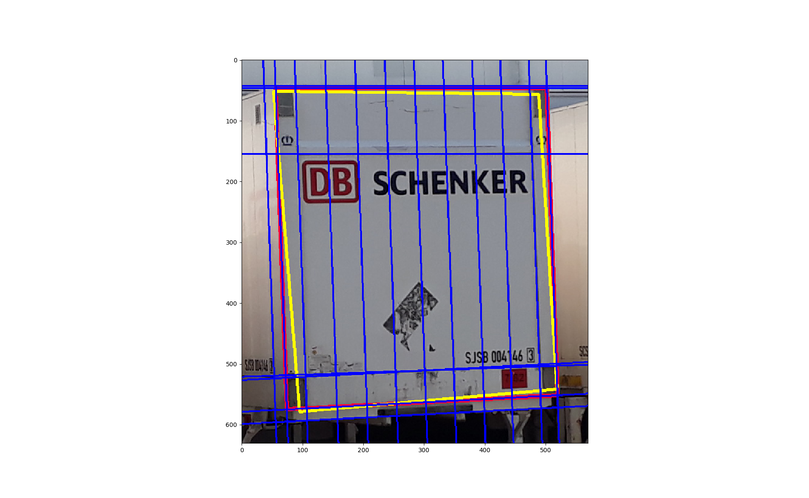
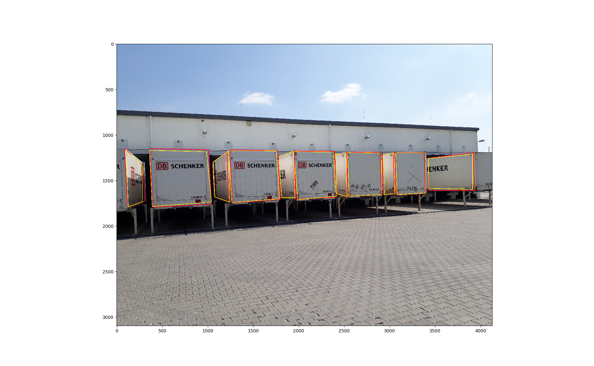

# Mask R-CNN for Swapbody Detection and Edge Approximation

This student-project is currently being carried out at Kamag Transport Technik, Ulm as a part of my masters program of Commercial Vehicle Technology at the University of Kaiserslautern. The project is an implementation of [Mask R-CNN](https://arxiv.org/abs/1703.06870) on Python 3, Keras, and TensorFlow. The source code is forked from [matterport/Mask_RCNN](https://github.com/matterport/Mask_RCNN). The model generates bounding boxes and segmentation masks for each instance of an object in the image. It's based on Feature Pyramid Network (FPN) and a ResNet101 backbone. We have trained the model on our custom dataset of swapbodies. Later we have used the generated mask to approximate the edges of the swapbody using [Ramer-Douglas-Peucker Algorithm](https://en.wikipedia.org/wiki/Ramer%E2%80%93Douglas%E2%80%93Peucker_algorithm) and [Hough Transformation](https://en.wikipedia.org/wiki/Hough_transform).

The repository includes:
* Source code of Mask R-CNN built on FPN and ResNet101.
* Training code for swapbody dataset. (swapbody.py)
* Source code to approximate the edges of the swapbody.

## Preparing the Dataset

To create the dataset we have captured about 2500 swapbody images from different distances at different angles. Among them we have selected 600 images and annotated them into two classes(1.back & 2.side) using Labelme.

## Training and Inference

We have trained the model on our swapbody dataset. After training we have implemented the trained model to get the masks for the swapbodies from our test images. The model is detecting the swapbody sides accurately and providing segmented image instances as masks. Although the masks provide give us the pixelwise location the containers faces, it is not really convenient to use the masks directly to obtain the exact edges.

  

## Polygon approximation from the detected mask

In order to get the exact edges, we separated the detected masks and obtained contours from the masks. And then from the contour we obtained the polylines using the [Ramer-Douglas-Peucker](https://en.wikipedia.org/wiki/Ramer%E2%80%93Douglas%E2%80%93Peucker_algorithm) algorithm.

  

## Edge Approximation from Hough Transformation

Based on the detected masks, we cropped the images to get the individual swapbody faces. Later we obtained binary images using histogram equalization and threshold. On the binary image we have applied hough transformation to get the prominent lines. 

At the end with the help of the polygon corner points we took the nearest lines to approximate the swapbody edges.

## Next Challenge

Determine the distance and the orientation or the pose of the swapbody with respect to camera coordinate system.
Finger crossed!
