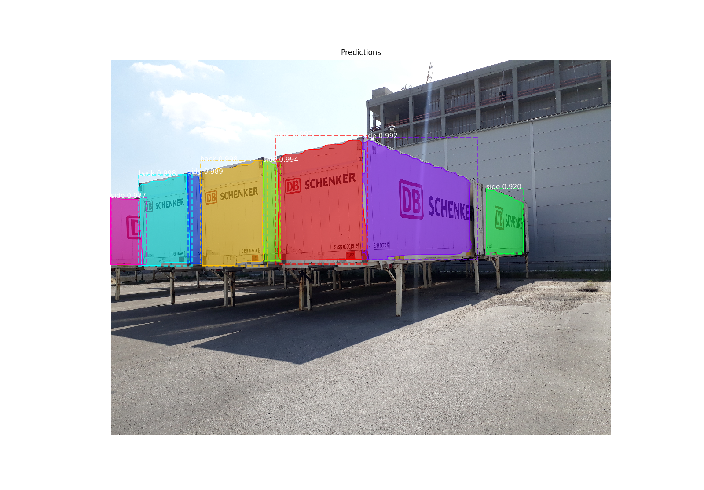
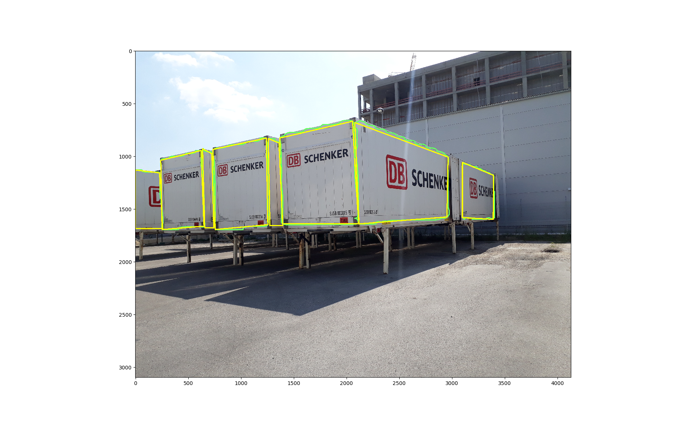

# Mask R-CNN for Object Detection and Segmentation

This is an implementation of [Mask R-CNN](https://arxiv.org/abs/1703.06870) on Python 3, Keras, and TensorFlow. The model generates bounding boxes and segmentation masks for each instance of an object in the image. It's based on Feature Pyramid Network (FPN) and a ResNet101 backbone.

The repository includes:
* Source code of Mask R-CNN built on FPN and ResNet101.
* Training code for swapbody dataset. (swapbody.py)
* Pre-trained weights for MS COCO
* Jupyter notebooks to visualize the detection pipeline at every step
* ParallelModel class for multi-GPU training
* Evaluation on MS COCO metrics (AP)

# Polygon approximation from the detected mask

We have separated the masks and saved within masks directory. 
mask2polygon.py converts the masks into contour first and then from contour it detects the polygon using the Ramer-Douglas-Pecuker algorithm.

